# Call Chain SVG

A tool that generates an svg of the calling relationship by specifying the input
Currently only in demo stage, not fully designed and polished

## Features

This tool supports two generation modes: topology mode, force-graph mode

> Modify the parameters in the index file to produce different effects

### topology mode

```ts
deal()
```


### force-graph mode

```ts
deal("force")
```



## Note

The demo is based on echarts, future iterations will most likely be implemented in svg.js

## Maintainer

@bagaking